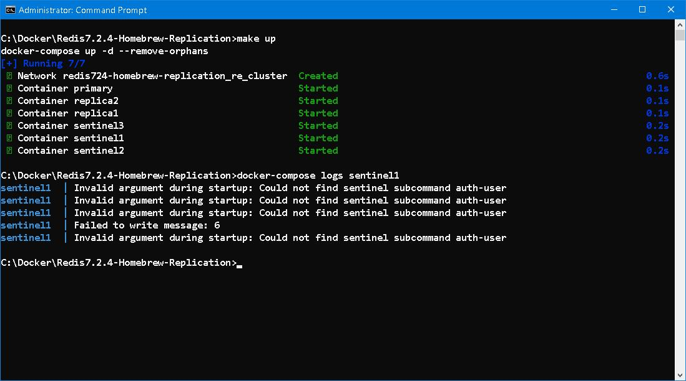

### Redis7.2.4-Homebrew-Replication

Rename `dotenv` to `.env` and set parameters accordingly. 

```
md data 
cd data 
md 6379 6380 6381 
```


The rest is history... 

---
[The Strange Case Of Sentinel And ACL](https://www.gutenberg.org/files/43/43-h/43-h.htm)

**Argument**

Strange enough! *Sentinel* has intriguing bearing on `ACL`... 

According to instructions on [RU330](https://redis.io/university/courses/ru330/) to disable `default` user in `acl.conf` 
```
user default off 
```

Have a glimpse of [documentation](https://redis.io/docs/latest/operate/oss_and_stack/management/config/): 
```
# If the master is password protected (using the "requirepass" configuration
# directive below) it is possible to tell the replica to authenticate before
# starting the replication synchronization process, otherwise the master will
# refuse the replica request.
#
# masterauth <master-password>
#
# However this is not enough if you are using Redis ACLs (for Redis version
# 6 or greater), and the default user is not capable of running the PSYNC
# command and/or other commands needed for replication. In this case it's
# better to configure a special user to use with replication, and specify the
# masteruser configuration as such:
#
# masteruser <username>
#
# When masteruser is specified, the replica will authenticate against its
# master using the new AUTH form: AUTH <username> <password>.
```

Thenceforth, `admin` user is setup in `acl.conf` and add `masteruser` directive to `redis.conf` of *Replica1* and *Replica2*. It's just fine in basic replication. 

However, this is not the case when *sentinels* come in sight... According to instructions on [RU301](https://redis.io/university/courses/ru301/) 
```
# In order for Sentinels to connect to Redis server instances when they are configured with requirepass, the Sentinel configuration must include the sentinel auth-pass directive.
sentinel auth-pass <myprimary> <master-password>
```

But there no such thing as `sentinel auth-user` subcommand. Which means it is forbidden to tamper `default` user or else failover mechanism would fail. Stranger than strange! As a matter fact, when using `default` user with `ACL` together, it would left the system unprotected...




**Corollary**

Don't use `ACL`, secure `default` user with strong password. 
```
ACL GENPASS 
```

### EOF (2024/07/08)